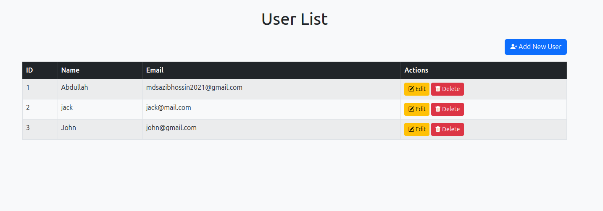
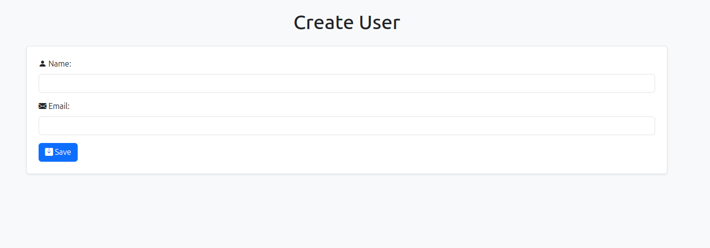
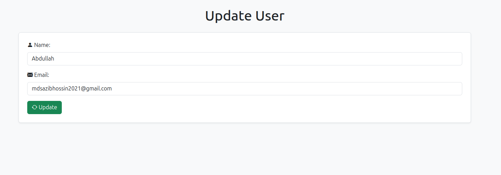

# My Go REST API

This project is a simple REST API built using Go. It performs basic CRUD operations for managing users in a MySQL database.

## Features

- **List Users**: View all users in the database.
- **Create User**: Add a new user with a name and email.
- **Update User**: Modify the details of an existing user.
- **Delete User**: Remove a user from the database.

## Technologies Used

- **Go**: Programming language used for building the API.
- **MySQL**: Database for storing user information.
- **Bootstrap**: Front-end framework for styling the web pages.

## Setup and Installation

1. **Clone the repository**:
   ```bash
   git clone https://github.com/abdullahalsazib/my_go_rest_api_static.git
   ```
   
2. **Navigate to the project directory**:
   ```bash
   cd my_go_rest_api_static
   ```

3. **Set up the database**:
   - Ensure you have MySQL installed and running.
   - Create a database named `userdb`.
   - Run the following SQL commands to set up the `users` table:
     ```sql
     CREATE TABLE users (
       id INT AUTO_INCREMENT PRIMARY KEY,
       name VARCHAR(100) NOT NULL,
       email VARCHAR(100) NOT NULL
     );
     ```

4. **Update database configuration**:
   - Modify the `dsn` constant in `main.go` with your MySQL username and password.

5. **Run the application**:
   ```bash
   go run main.go
   ```

6. **Access the application**:
   - Open a web browser and go to `http://localhost:8080`.

## API Endpoints

- `GET /`: List all users.
- `GET /create`: Display the form to create a new user.
- `POST /save`: Save a new user to the database.
- `GET /edit?id={id}`: Display the form to edit a user's details.
- `POST /update`: Update a user's information.
- `GET /delete?id={id}`: Delete a user from the database.

## License

This project is licensed under the MIT License.



